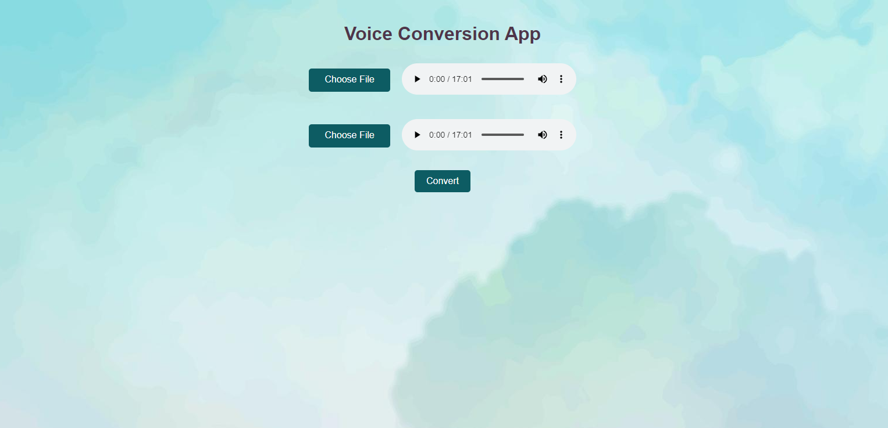

# Voice Conversion Application

This application using Hifi GAN model 

## Application running instructions

In the project directory, you can run:

### `npm install`
For install node package dependencies

### `npm run start`
Runs the app in the development mode.\
Open [http://localhost:3000](http://localhost:3000) to view it in your browser.

The page will reload when you make changes.\
You may also see any lint errors in the console.

